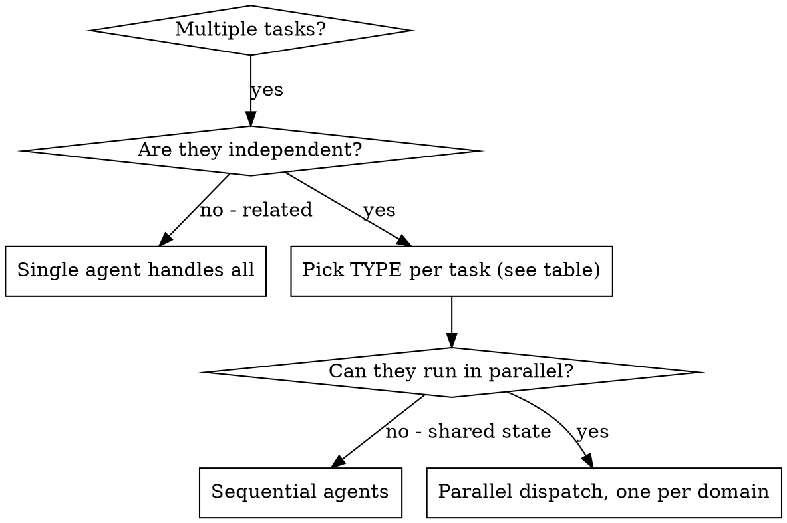

# Fan-Out Subagents

## Overview

You delegate independent tasks to subagents so they run concurrently while you keep your own context for coordination. When you have multiple unrelated problems (different files, subsystems, bugs, research threads), investigating them sequentially wastes time — each one is independent and can happen in parallel.

There are **two dispatch modes**, and picking the right one per task is the single most important decision:

- **Isolated named subagent** (`Explore`, `Debug-Explore`, `Research`, `general-purpose`, …): starts in a *fresh* context window. It does NOT see your conversation history, the files you've read, or the skills you've loaded. You hand it a delegation prompt and it works from that summary. Best for self-contained exploration, debugging investigation, and research.
- **Full-context fork** (`subagent_type: fork`): inherits the *entire* conversation so far — same system prompt, tools, model, and message history as the main session. Its own tool calls stay out of your context; only its final result returns. Best for **coding/fixing/refactoring**, where the work depends on the real files, decisions, and state already established in the session. A delegation summary would be lossy exactly where code work is unforgiving.

**Core principle:** Dispatch one agent per independent problem domain, and match the subagent TYPE to the task. Coding → fork. Locate in codebase → Explore. Root-cause a bug → Debug-Explore. External research → Research.

## Choose the subagent type FIRST

Before writing any dispatch, classify each task and pick its type. Do this explicitly — do not copy a type from an example without checking it fits.

| Task kind | Subagent type | Why |
| :-- | :-- | :-- |
| Write / edit / fix / refactor code | **`fork`** | Needs the session's real files and decisions, not a summary. Inherits full context; first request reuses the parent prompt cache (cheaper). |
| Locate / map / search the codebase (fast, shallow) | **`Explore`** | Read-only, **Haiku**. Cheap "where does X live" file discovery. Keeps search output out of main context. |
| Investigate a bug / root cause — reproduce, read traces, form hypotheses (read-only) | **`Debug-Explore`** | Read-only on the **inherited main model** (not Haiku), because real diagnosis needs real reasoning. Returns a diagnosis; the fix is a separate `fork`. |
| External research, web, docs, papers, repos | **`Research`** | Sonnet. Retrieval + light synthesis is Sonnet-grade; faster and cheaper, same quality on standard lookups. Read-only. Advanced-tier synthesis is reconciled by a `fork`, not a separate research type — see Parallel research. |
| Mixed exploration+action with all tools, that is neither pure coding nor pure research | `general-purpose` | Fallback only. Has all tools but starts from a lossy summary. |

**The critical rule:** for coding, request `subagent_type: fork` *explicitly*. Omitting the subagent type does NOT produce a fork — it produces `general-purpose`, which starts from a lossy summary. This is the #1 misfire: general-purpose is a fully capable coding agent, so nothing stops it from coding badly from incomplete context. Choose `fork` on purpose.

> Fork requires Claude Code v2.1.117+. Claude-spawned forks roll out in stages; `CLAUDE_CODE_FORK_SUBAGENT=1` is only an explicit override and is not required once the rollout is active in your session. A fork can't spawn another fork. When fork mode is active, every spawn runs in the background.

> **Worker naming:** `fork` and `Explore` are native types (no setup). The `Research` and `Debug-Explore` workers ship with this plugin and, when installed as a plugin, register under scoped names — `fan-out-subagents:Research` and `fan-out-subagents:Debug-Explore`. Use those as the `subagent_type`, or copy the agents to user/project scope (`~/.claude/agents/Research.md`, `~/.claude/agents/Debug-Explore.md`) to use the bare names. Examples below write `Research` / `Debug-Explore` for readability.

## When to Use



**Use when:**
- 3+ files failing or changing with different root causes
- Multiple subsystems broken or to be modified independently
- Research that spans several independent source surfaces (see Parallel research below)
- Each problem can be understood without context from the others

**Don't use when:**
- Tasks are related (fixing one might fix/affect others) — investigate together first
- You need to understand full system state before splitting
- Agents would interfere (editing the same files / racing writes) — see worktree note below

## The Pattern

### 1. Identify Independent Domains

Group the work by what's affected — one domain per independent file, subsystem, or source surface.

### 2. Pick the type for each domain

Run each domain through the table above. Coding domains → `fork`. A codebase-mapping pass → `Explore`. A bug investigation → `Debug-Explore`. External research → `Research`. Write the type down before dispatching.

### 3. Create Focused Agent Tasks

Each agent gets:
- **Type:** chosen per the table (state it explicitly in the dispatch)
- **Specific scope:** one file, subsystem, or source surface
- **Clear goal:** what "done" means
- **Constraints:** what NOT to touch
- **Expected output:** a *narrow* summary of what was found and changed

Note: a `fork` already has the full session, so its prompt can be *shorter* — you don't re-explain the codebase, only the specific task and constraints. An isolated agent (`Explore`/`Debug-Explore`/`Research`/`general-purpose`) needs all relevant context spelled out, because it sees nothing of your session.

### 4. Dispatch in Parallel

Issue all dispatches in the **same response** — they run concurrently. One dispatch per response would run them sequentially.

```text
# Coding domains → fork (full context):
Agent (subagent_type: fork): "Fix agent-tool-abort.test.ts failures"
Agent (subagent_type: fork): "Fix batch-completion-behavior.test.ts failures"
Agent (subagent_type: fork): "Fix tool-approval-race-conditions.test.ts failures"
# All three run concurrently, each inheriting the full session context.
```

```text
# Mixed example — match each task to its type:
Agent (subagent_type: Explore):  "Map where retry logic lives across the http layer"
Agent (subagent_type: Research): "Find the current axios-retry recommended config (web + docs)"
Agent (subagent_type: fork):     "Implement the retry wrapper in src/http/client.ts"
```

**Parallel file edits:** if multiple forks will write to the same checkout, pass `isolation: "worktree"` so each fork edits an isolated git worktree instead of racing writes on your working tree. Integrate the worktrees afterward.

### 5. Review and Integrate

When agents return: read each summary, verify fixes don't conflict (worktrees prevent this), run the full test suite, integrate all changes.

## Parallel research (tiered)

External research scales by **source surface** (repos / state-of-the-art papers / docs / context7 / web), one agent per surface — the same "one agent per independent domain" principle applied to research.

**As soon as a request involves external research, read `references/research-tiers.md` once.** It is the tier selector: it tells you whether this is **light** (a single `Research` agent — no orchestration, dispatch it directly and stop), **moderate** (fan out `Research` across surfaces, no reconcile), or **advanced** (fan out, then reconcile via a full-context `fork`). Read it once per session when research first comes up; you don't need to re-read it for every subsequent research dispatch.

Surfaces (repos / sota / docs / context7 / web) describe *what* to find, not *where* — a surface is a lens, not a fenced location, and agents range across sources to hit their goal. Caveat: every fan-out summary returns to the main context, so bind each surface agent to a *narrow* summary, and on advanced runs consolidate via the `fork` reconcile (which already holds the findings) rather than collecting raw blocks in main.

## Agent Prompt Structure

Good agent prompts are **focused** (one domain), **right-sized for the type** (forks need only task + constraints; isolated agents need full context), and **specific about output** (what to return).

```markdown
Fix the 3 failing tests in src/agents/agent-tool-abort.test.ts:

1. "should abort tool with partial output capture" - expects 'interrupted at' in message
2. "should handle mixed completed and aborted tools" - fast tool aborted instead of completed
3. "should properly track pendingToolCount" - expects 3 results but gets 0

These are timing/race condition issues. Your task:
1. Read the test file and understand what each test verifies
2. Identify root cause - timing issues or actual bugs?
3. Fix by replacing arbitrary timeouts with event-based waiting, fixing abort bugs,
   or adjusting test expectations if behavior changed. Do NOT just increase timeouts.

Return: Summary of what you found and what you fixed.
```

(Dispatch the above as `subagent_type: fork` — it's coding and benefits from the session's full context.)

## Common Mistakes

**❌ Wrong type — general-purpose for coding:** the default trap. general-purpose works from a lossy summary and will confidently code from incomplete context.
**✅ Right type:** `subagent_type: fork` for any write/edit/fix/refactor.

**❌ Assuming "omit type = fork":** omitting the type yields general-purpose, not a fork. Request `fork` explicitly.

**❌ Sending a real debugging investigation to `Explore`:** Explore is Haiku and shallow — fine for "where does X live", too weak to root-cause a failure.
**✅** `Debug-Explore` (inherited model, read-only) for diagnosis; then a `fork` to implement the fix.

**❌ Orchestrating a light research task:** a single-surface lookup needs one `Research` agent, not a fan-out. Don't build a tier-2 dispatch for a tier-1 question.

**❌ Too broad:** "Fix all the tests." **✅ Specific:** "Fix agent-tool-abort.test.ts."

**❌ No context to an isolated agent.** **✅** paste errors/test names (or use a fork, which already has them).

**❌ No constraints → agent refactors everything.** **✅** "Do NOT change production code" / "tests only".

**❌ Parallel forks clobbering each other's files.** **✅** `isolation: "worktree"` per fork, integrate after.

## When NOT to Use

**Related tasks:** fixing one might fix others — investigate together first.
**Need full context yourself:** understanding requires seeing the whole system before splitting.
**Exploratory debugging:** you don't yet know what's broken.
**Shared mutable state:** agents would interfere; serialize them or isolate with worktrees.

## Real Example (parallel coding via fork)

**Scenario:** 6 test failures across 3 files after a major refactor.

**Type decision:** all three files are coding tasks that depend on understanding the refactor already done this session → `fork` for each (NOT general-purpose).

**Dispatch (same response, concurrent):**
```
Agent (subagent_type: fork) → Fix agent-tool-abort.test.ts
Agent (subagent_type: fork) → Fix batch-completion-behavior.test.ts
Agent (subagent_type: fork) → Fix tool-approval-race-conditions.test.ts
```

**Results:** event-based waiting replaced timeouts; event-structure bug fixed; async-execution wait added. Independent fixes, no conflicts, suite green. Each fork started from the real refactored code, not a summary.

## Verification

After agents return: review each summary, check for conflicts (worktrees avoid this), run the full suite, spot check (agents can make systematic errors).

## Key Benefits

1. **Parallelization** — multiple tasks at once
2. **Right context per task** — forks code from real state; isolated agents keep research out of main context
3. **Independence** — agents don't interfere (especially with worktrees)
4. **Speed & cost** — forks share the parent prompt cache; research runs on cheaper Sonnet, with advanced synthesis reconciled by a full-context fork that already holds the findings
